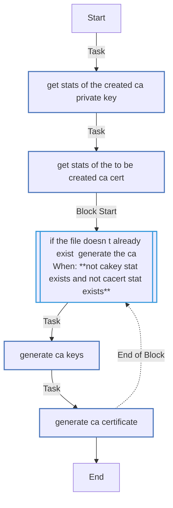
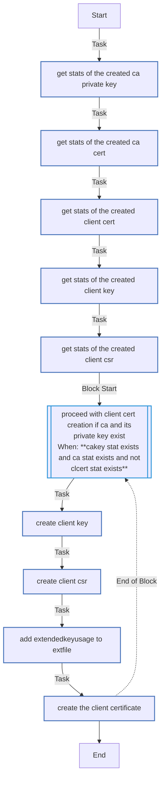
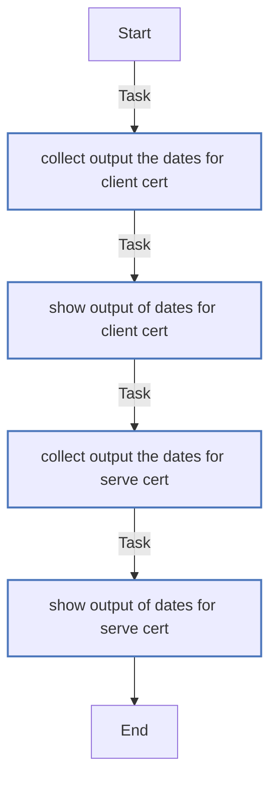
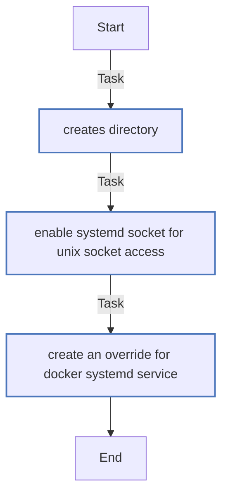
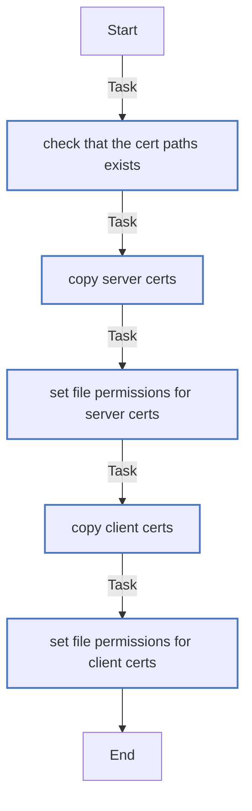
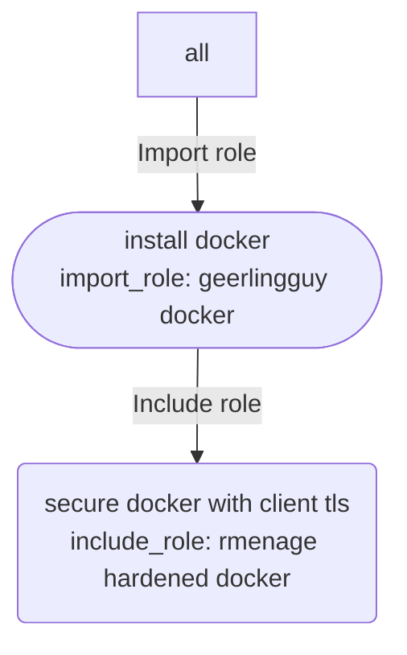

<!-- DOCSIBLE START -->

# 📃 Role overview

## role-hardened-docker


Description: hardened setup for Docker on Linux, client TLS for TCP port access to the daemon


| Field                | Value           |
|--------------------- |-----------------|
| Readme update        | 10/11/2025 |


### Defaults

**These are static variables with lower priority**

#### File: defaults/main.yml

| Var          | Type         | Value       |
|--------------|--------------|-------------|
| [rhd_restart_docker](defaults/main.yml#L3)   | bool | `True` |    
| [rhd_docker_restart_handler_state](defaults/main.yml#L4)   | str | `restarted` |    
| [rhd_secured_tcp_listener](defaults/main.yml#L7)   | bool | `False` |    
| [rhd_system_tmp](defaults/main.yml#L11)   | str | `/tmp` |    
| [rhd_country](defaults/main.yml#L12)   | str | `XX` |    
| [rhd_state](defaults/main.yml#L13)   | str | `Default State` |    
| [rhd_locality](defaults/main.yml#L14)   | str | `Default City` |    
| [rhd_organization](defaults/main.yml#L15)   | str | `Default Company` |    
| [rhd_host](defaults/main.yml#L16)   | str | `127.0.0.1` |    
| [rhd_common_name](defaults/main.yml#L17)   | str | `{{ rhd_host }}` |    
| [rhd_passphrase](defaults/main.yml#L18)   | str | `Ch4ng3M3!` |    
| [rhd_server_cert_path](defaults/main.yml#L19)   | str | `/etc/docker` |    
| [rhd_client_cert_path](defaults/main.yml#L20)   | str | `~/.docker` |    
| [rhd_days](defaults/main.yml#L21)   | int | `365` |    
| [rhd_ca_days](defaults/main.yml#L22)   | str | `{{ rhd_days }}` |    
| [rhd_server_days](defaults/main.yml#L23)   | str | `{{ rhd_days }}` |    
| [rhd_client_days](defaults/main.yml#L24)   | str | `{{ rhd_days }}` |    
| [rhd_ca_cert_subj](defaults/main.yml#L25)   | str | `/C={{ rhd_country }}/ST={{ rhd_state }}/L={{ rhd_locality }}/O={{ rhd_organization }}/CN={{ rhd_common_name }}` |    


### Vars

**These are variables with higher priority**
#### File: vars/main.yml

| Var          | Type         | Value       |
|--------------|--------------|-------------|
| [rhd_temp_path](vars/main.yml#L2)   | str | `{{ rhd_system_tmp }}/ansible_rhd` |    
| [rhd_passfile](vars/main.yml#L3)   | str | `{{ rhd_temp_path }}/passphrase.txt` |    
| [rhd_csr_form_file](vars/main.yml#L4)   | str | `{{ rhd_temp_path }}/csr_form.txt` |    
| [rhd_extfile](vars/main.yml#L5)   | str | `{{ rhd_temp_path }}/extfile.cnf` |    
| [rhd_server_extfile](vars/main.yml#L6)   | str | `{{ rhd_temp_path }}/server_extfile.cnf` |    
| [rhd_ca_key](vars/main.yml#L7)   | str | `{{ rhd_temp_path }}/ca-key.pem` |    
| [rhd_ca_cert](vars/main.yml#L8)   | str | `{{ rhd_temp_path }}/ca.pem` |    
| [rhd_cl_key](vars/main.yml#L9)   | str | `{{ rhd_temp_path }}/key.pem` |    
| [rhd_cl_csr](vars/main.yml#L10)   | str | `{{ rhd_temp_path }}/client.csr` |    
| [rhd_cl_cert](vars/main.yml#L11)   | str | `{{ rhd_temp_path }}/cert.pem` |    
| [rhd_sv_key](vars/main.yml#L12)   | str | `{{ rhd_temp_path }}/server-key.pem` |    
| [rhd_sv_csr](vars/main.yml#L13)   | str | `{{ rhd_temp_path }}/server.csr` |    
| [rhd_sv_cert](vars/main.yml#L14)   | str | `{{ rhd_temp_path }}/server-cert.pem` |    


### Tasks


#### File: tasks/generate_ca_cert.yml

| Name | Module | Has Conditions |
| ---- | ------ | -------------- |
| Get stats of the created CA private key | ansible.builtin.stat | False |
| Get stats of the to be created CA cert | ansible.builtin.stat | False |
| If the file doesn't already exist, generate the CA | block | True |
| Generate CA keys | ansible.builtin.command | False |
| Generate ca certificate | ansible.builtin.command | False |

#### File: tasks/generate_client_cert.yml

| Name | Module | Has Conditions |
| ---- | ------ | -------------- |
| Get stats of the created CA private key | ansible.builtin.stat | False |
| Get stats of the created CA cert | ansible.builtin.stat | False |
| Get stats of the created client cert | ansible.builtin.stat | False |
| Get stats of the created client key | ansible.builtin.stat | False |
| Get stats of the created client CSR | ansible.builtin.stat | False |
| Proceed with client cert creation if CA and its private key exist | block | True |
| Create client key | ansible.builtin.command | False |
| Create client CSR | ansible.builtin.command | False |
| Add extendedKeyUsage to extfile | ansible.builtin.lineinfile | False |
| Create the client certificate | ansible.builtin.command | False |

#### File: tasks/generate_server_cert.yml

| Name | Module | Has Conditions |
| ---- | ------ | -------------- |
| Get stats of the created CA private key | ansible.builtin.stat | False |
| Get stats of the created CA cert | ansible.builtin.stat | False |
| Get stats of the server cert (not running if already exists) | ansible.builtin.stat | False |
| Get stats of the created server key | ansible.builtin.stat | False |
| Get stats of the created server CSR | ansible.builtin.stat | False |
| Proceed with server cert creation if CA and its private key exist | block | True |
| Create server key | ansible.builtin.command | False |
| Create the server CSR | ansible.builtin.command | False |
| Add alt name to extfile | ansible.builtin.lineinfile | False |
| Set the docker daemon's key extended usage attributes to only server authentication | ansible.builtin.lineinfile | False |
| Create the server certificate | ansible.builtin.command | False |

#### File: tasks/main.yml

| Name | Module | Has Conditions |
| ---- | ------ | -------------- |
| Check that docker is installed | ansible.builtin.command | False |
| Check that docker has active systemd service | ansible.builtin.systemd_service | False |
| Create a temp directory | ansible.builtin.file | False |
| Add passphrase to the file | ansible.builtin.lineinfile | False |
| Unnamed | ansible.builtin.include_tasks | False |
| Unnamed | ansible.builtin.include_tasks | False |
| Unnamed | ansible.builtin.include_tasks | False |
| Unnamed | ansible.builtin.include_tasks | False |
| Unnamed | ansible.builtin.include_tasks | True |
| Unnamed | ansible.builtin.include_tasks | False |

#### File: tasks/organise_cert_files.yml

| Name | Module | Has Conditions |
| ---- | ------ | -------------- |
| Check that the cert paths exists | ansible.builtin.file | False |
| Copy server certs | ansible.builtin.command | False |
| Set file permissions for server certs | ansible.builtin.file | False |
| Copy client certs | ansible.builtin.command | False |
| Set file permissions for client certs | ansible.builtin.file | False |

#### File: tasks/output.yml

| Name | Module | Has Conditions |
| ---- | ------ | -------------- |
| Collect output the dates for client cert | ansible.builtin.command | False |
| Show output of dates for client cert | ansible.builtin.debug | False |
| Collect output the dates for serve cert | ansible.builtin.command | False |
| Show output of dates for serve cert | ansible.builtin.debug | False |

#### File: tasks/setup_daemon_authenticated_tcp_listener.yml

| Name | Module | Has Conditions |
| ---- | ------ | -------------- |
| Creates directory | ansible.builtin.file | False |
| Enable systemd socket for unix socket access | ansible.builtin.systemd_service | False |
| Create an override for docker systemd service | ansible.builtin.template | False |


## Task Flow Graphs


### Graph for generate_ca_cert.yml




### Graph for generate_client_cert.yml




### Graph for output.yml




### Graph for setup_daemon_authenticated_tcp_listener.yml




### Graph for organise_cert_files.yml




### Graph for generate_server_cert.yml

```mermaid
flowchart TD
Start
classDef block stroke:#3498db,stroke-width:2px;
classDef task stroke:#4b76bb,stroke-width:2px;
classDef includeTasks stroke:#16a085,stroke-width:2px;
classDef importTasks stroke:#34495e,stroke-width:2px;
classDef includeRole stroke:#2980b9,stroke-width:2px;
classDef importRole stroke:#699ba7,stroke-width:2px;
classDef includeVars stroke:#8e44ad,stroke-width:2px;
classDef rescue stroke:#665352,stroke-width:2px;

  Start-->|Task| Get_stats_of_the_created_CA_private_key0[get stats of the created ca private key]:::task
  Get_stats_of_the_created_CA_private_key0-->|Task| Get_stats_of_the_created_CA_cert1[get stats of the created ca cert]:::task
  Get_stats_of_the_created_CA_cert1-->|Task| Get_stats_of_the_server_cert__not_running_if_already_exists_2[get stats of the server cert  not running if<br>already exists ]:::task
  Get_stats_of_the_server_cert__not_running_if_already_exists_2-->|Task| Get_stats_of_the_created_server_key3[get stats of the created server key]:::task
  Get_stats_of_the_created_server_key3-->|Task| Get_stats_of_the_created_server_CSR4[get stats of the created server csr]:::task
  Get_stats_of_the_created_server_CSR4-->|Block Start| Proceed_with_server_cert_creation_if_CA_and_its_private_key_exist5_block_start_0[[proceed with server cert creation if ca and its<br>private key exist<br>When: **cakey stat exists and ca stat exists and not<br>svcert stat exists**]]:::block
  Proceed_with_server_cert_creation_if_CA_and_its_private_key_exist5_block_start_0-->|Task| Create_server_key0[create server key]:::task
  Create_server_key0-->|Task| Create_the_server_CSR1[create the server csr]:::task
  Create_the_server_CSR1-->|Task| Add_alt_name_to_extfile2[add alt name to extfile]:::task
  Add_alt_name_to_extfile2-->|Task| Set_the_docker_daemon_s_key_extended_usage_attributes_to_only_server_authentication3[set the docker daemon s key extended usage<br>attributes to only server authentication]:::task
  Set_the_docker_daemon_s_key_extended_usage_attributes_to_only_server_authentication3-->|Task| Create_the_server_certificate4[create the server certificate]:::task
  Create_the_server_certificate4-.->|End of Block| Proceed_with_server_cert_creation_if_CA_and_its_private_key_exist5_block_start_0
  Create_the_server_certificate4-->End
```




### Graph for main.yml

```mermaid
flowchart TD
Start
classDef block stroke:#3498db,stroke-width:2px;
classDef task stroke:#4b76bb,stroke-width:2px;
classDef includeTasks stroke:#16a085,stroke-width:2px;
classDef importTasks stroke:#34495e,stroke-width:2px;
classDef includeRole stroke:#2980b9,stroke-width:2px;
classDef importRole stroke:#699ba7,stroke-width:2px;
classDef includeVars stroke:#8e44ad,stroke-width:2px;
classDef rescue stroke:#665352,stroke-width:2px;

  Start-->|Task| Check_that_docker_is_installed0[check that docker is installed]:::task
  Check_that_docker_is_installed0-->|Task| Check_that_docker_has_active_systemd_service1[check that docker has active systemd service]:::task
  Check_that_docker_has_active_systemd_service1-->|Task| Create_a_temp_directory2[create a temp directory]:::task
  Create_a_temp_directory2-->|Task| Add_passphrase_to_the_file3[add passphrase to the file]:::task
  Add_passphrase_to_the_file3-->|Include task| Unnamed_task_4_generate_ca_cert_yml_4[unnamed task 4<br>include_task: generate ca cert yml]:::includeTasks
  Unnamed_task_4_generate_ca_cert_yml_4-->|Include task| Unnamed_task_5_generate_server_cert_yml_5[unnamed task 5<br>include_task: generate server cert yml]:::includeTasks
  Unnamed_task_5_generate_server_cert_yml_5-->|Include task| Unnamed_task_6_generate_client_cert_yml_6[unnamed task 6<br>include_task: generate client cert yml]:::includeTasks
  Unnamed_task_6_generate_client_cert_yml_6-->|Include task| Unnamed_task_7_organise_cert_files_yml_7[unnamed task 7<br>include_task: organise cert files yml]:::includeTasks
  Unnamed_task_7_organise_cert_files_yml_7-->|Include task| Unnamed_task_8_setup_daemon_authenticated_tcp_listener_yml_8[unnamed task 8<br>When: **rhd secured tcp listener   bool**<br>include_task: setup daemon authenticated tcp listener yml]:::includeTasks
  Unnamed_task_8_setup_daemon_authenticated_tcp_listener_yml_8-->|Include task| Unnamed_task_9_output_yml_9[unnamed task 9<br>include_task: output yml]:::includeTasks
  Unnamed_task_9_output_yml_9-->End
```




## Playbook

```yml
---
- name: Example Usage
  hosts: all
  gather_facts: true # Disable if your role does not rely on facts
  tasks:
    - name: Install docker
      ansible.builtin.import_role:
        name: geerlingguy.docker
      vars:
        docker_service_manage: true
        docker_daemon_options:
          log-opts:
            max-size: "50m"
            max-file: "3"
    - name: Secure Docker with client TLS
      ansible.builtin.include_role:
        name: rmenage.hardened_docker
      vars:
        rhd_server_cert_path: /etc/docker
        rhd_client_cert_path: /vagrant/docker-client-certs
        rhd_host: "127.0.0.1"
        rhd_secured_tcp_listener: yes

```
## Playbook graph


## Author Information
rmenage

#### License

MIT

#### Minimum Ansible Version

2.15.1

#### Platforms

- **Ubuntu**: ['noble']


#### Dependencies

No dependencies specified.
<!-- DOCSIBLE END -->
